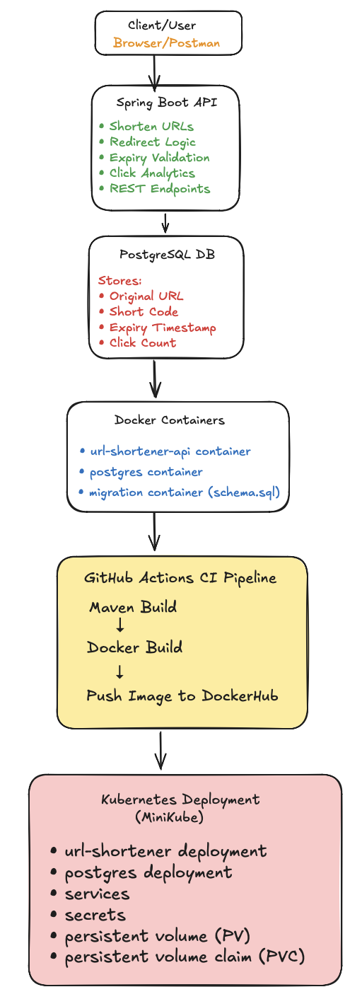
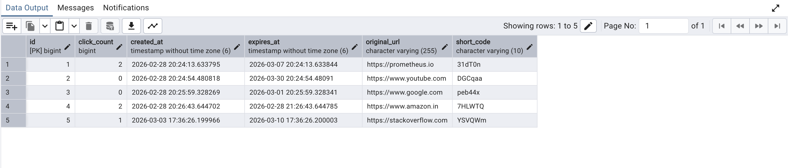

# URL Shortener – Spring Boot + PostgreSQL

A production-style **URL Shortener REST API** built using **Java, Spring Boot, Spring Data JPA, and PostgreSQL**.

The application allows users to:

- Create short links
- Redirect using short codes
- Track click analytics
- Generate expiring URLs

This project demonstrates:

- Backend API design
- Database modeling
- Docker containerization
- Kubernetes deployment
- CI pipeline automation

---

# Features

## Core Features

- Create short URLs from long URLs
- Redirect using short code
- PostgreSQL persistence
- Clean layered architecture

---

## Advanced Features

- URL expiry with selectable duration
- Click count tracking (basic analytics)
- DTO validation
- Custom exception handling
- Environment variable based configuration

---

# Tech Stack

| Category | Technology |
|--------|--------|
| Language | Java 21 |
| Framework | Spring Boot |
| Database | PostgreSQL |
| ORM | Spring Data JPA (Hibernate) |
| Build Tool | Maven |
| Containerization | Docker |
| Orchestration | Kubernetes |
| CI Pipeline | GitHub Actions |

---

# Architecture



## API Endpoints

### 1. Shorten URL

**POST** `/api/shorten`

Request:

```json
{
  "originalUrl": "https://google.com",
  "expiryDuration": "ONE_DAY"
}
```

Response:

```json
{
  "shortUrl": "http://localhost:8081/aB3dE1"
}
```

---

### 2. Redirect to Original URL

**GET** `/{shortCode}`

Example:

```
http://localhost:8081/aB3dE1
```

- Redirects to original URL
- Returns `410 GONE` if expired
- Returns `404 NOT FOUND` if short code does not exist

---

## Expiry Options

| Option | Duration |
|--------|----------|
| ONE_HOUR | 1 hour |
| ONE_DAY | 24 hours |
| SEVEN_DAYS | 7 days |
| THIRTY_DAYS | 30 days |

---

## Click Analytics

Each redirect increments a click counter stored in the database.

This demonstrates read-modify-write database operations and basic analytics tracking.



---

## Project Structure

```
url-shortener
│
├── src/main/java/com/example/urlshortener
│   ├── controller
│   │   ├── RedirectController.java
│   │   └── UrlController.java
│   │
│   ├── dto
│   │   ├── UrlRequest.java
│   │   └── UrlResponse.java
│   │
│   ├── entity
│   │   └── UrlRecord.java
│   │
│   ├── exception
│   │   ├── ShortUrlNotFoundException.java
│   │   └── UrlExpiredException.java
│   │
│   ├── repository
│   │   └── UrlRecordRepository.java
│   │
│   ├── service
│   │   ├── UrlService.java
│   │   └── UrlServiceImplementation.java
│   │
│   ├── util
│   │   └── ExpiryDuration.java
│   │
│   └── UrlShortenerApplication.java
│
├── src/main/resources
│   ├── application.yml
│   └── db/migration/schema.sql
│
├── k8s
│   ├── namespace.yaml
│   ├── url-shortener-deployment.yaml
│   ├── url-shortener-service.yaml
│   ├── postgres-deployment.yaml
│   ├── postgres-service.yaml
│   ├── postgres-pv.yaml
│   └── postgres-pvc.yaml
│
├── docker-compose.yaml
├── Dockerfile
├── .github/workflows/ci.yml
│
├── images
│   └── architecture.png
│
└── pom.xml
```

---

## How to Run Locally

### 1. Clone Repository

```bash
git clone https://github.com/nsahil992/URL-Shortener.git
```

### 2. Setup Environment Variables

Create a `.env` file. Make sure to have the following dependency in pom.xml file:
```
    <dependency>
            <groupId>me.paulschwarz</groupId>
            <artifactId>spring-dotenv</artifactId>
            <version>4.0.0</version>
    </dependency>
```

```
DB_URL=jdbc:postgresql://localhost:5432/url_shortener_db
DB_USERNAME=your_username
DB_PASSWORD=your_password
```

### 3. Create Database

```sql
CREATE DATABASE url_shortener_db;
```

### 4. Run Application

```bash
./mvnw spring-boot:run
```

Application runs at:

```
http://localhost:8081
```

#### Run using Docker Compose:

```
docker compose up --build
```

Application runs at:

```
http://localhost:8081
```
---

# Kubernetes Deployment

The application can be deployed to **Kubernetes (Minikube)**.

The deployment includes the following components:

- **Namespace** for isolating resources
- **Spring Boot API Deployment**
- **PostgreSQL Deployment**
- **Kubernetes Services** for internal communication
- **Secrets** for database credentials
- **Persistent Volume (PV)** for database storage
- **Persistent Volume Claim (PVC)** for persistent data

---

## Deploy the Application

Apply all Kubernetes manifests:

```bash
kubectl apply -f k8s/
```

Access the application

```bash
kubectl port-forward svc/url-shortener-service 8081:80 -n url-shortener
```

The application will be available at:
```bash
http://localhost:8081
```

## Future Improvements

- Base62 encoding for short codes
- Rate limiting
- Redis caching
- User authentication using Spring Security
- Adding tests

---
